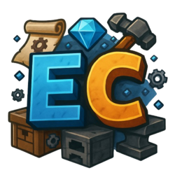

# 📌 Information EC

## Description&#x20;

ExecutableCrafting empowers Minecraft server owners to go beyond vanilla and create **fully customized, condition-based crafting recipes** with **zero coding required**. Add custom crafting, anvil, or furnace recipes, enforce player conditions, group recipes, and even build entire **interactive recipe books** — all using an intuitive interface and YAML configs.

Whether you're creating a hardcore RPG survival experience, a magic PvP server, or just want better control over your crafting system, **ExecutableCrafting is the plugin you’ve been looking for**.

Video available soon

## Support

#### Need help, report a bug or submit a suggestion? Something is not in the wiki or poorly explained ?

* Join the [Discord](https://discord.com/invite/TRmSwJaYNv)

## Free version

* Download on [Modrinth](https://modrinth.com/plugin/executablecrafting)
* Download on&#x20;
* Download on [Discord](https://discord.com/channels/701066025516531753/1370389666758524938)

## Premium version 


Subscription: 4.99€/month

For:&#x20;

* MyFurniture Premium
* ExecutableItems Premium
* ExecutableCrafting Premium
* ExecutableLevers
* CustomPiglinsTrades



You want the access to all the features, and support my work ?

&#x20;You can subscribe on the discord into the [channel subscription](https://discord.com/channels/701066025516531753/1333041782010937385).

