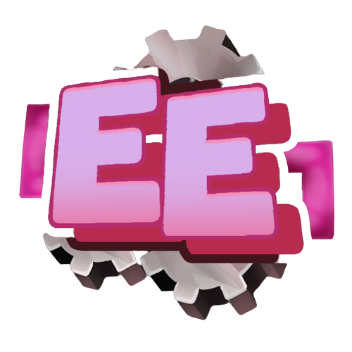

# 📌 Information EE

## Description

A plugin that allows you to customize the events that occur on your server. it contains a lot of pre-made custom conditions and custom commands which will make your life easier to customize your server!

Let's take a look at the events that you can customize here:&#x20;


[activator-configuration](configurations/activator-configuration/)


## Support

#### Need help, report a bug or submit a suggestion? Something is not in the wiki or poorly explained ?

* Join the [Discord](https://discord.com/invite/TRmSwJaYNv)

## Free version

* Download on [Modrinth](https://modrinth.com/plugin/executableevents)
* Download on [Spigot](https://www.spigotmc.org/resources/custom-events-plugin-executableevents.107622/)
* Download on [Discord](https://discord.com/channels/701066025516531753/1344653581789167737)

## Premium version (12.29€) 


You want the access to all the features, and support my work ?

Premium ExecutableEvents:


* Purchase on [Spigot](https://www.spigotmc.org/resources/%E2%AD%90-executableevents-%E2%AD%90-customize-your-events-very-easily.106537/)
* Purchase on [Polymart](https://polymart.org/resource/executableevents.3198)
* Purchase on [BuiltByBit](https://builtbybit.com/resources/executable-events.30657/)
* Purchase using RUB on Boosty (Contact Ssomar on the discord)
* Purchase on Ssomar Website (then go on the discord to get the plugin.[ Download Premium](https://discord.com/channels/701066025516531753/1134158681769005076))

### [Support the development](https://buy.stripe.com/aEU7sX66l3O82MUdQT)
