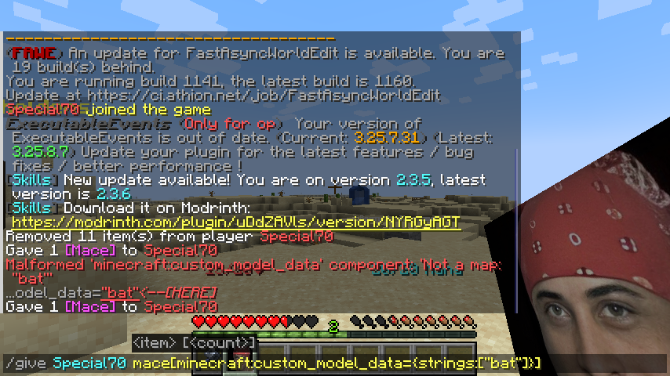

# Custom textures \[1.21.4+] (Article Version)


IN ANY CIRCUMSTANCES, DO NOT USE UPPERCASE CHARACTERS OR COMPLICATIONS WILL OCCUR.

ONLY USE LOWERCASE AND UNDERSCORE CHARACTERS AS MUCH AS POSSIBLE


## Steps:

### Step 1: Create folder

Create the folder that will contain the texture pack

<figure><figcaption></figcaption></figure>

### Step 2: Create basic files

<figure><figcaption></figcaption></figure>

* pack.png - displays the png the texture pack will display in the texture packs menu (Optional)
* pack.mcmeta - important file that will define what kind of tpack this is



Example:

```json
{
    "pack": {
        "pack_format": 46,
        "description": "By Special70"
    }
}
```



We will type 46 in pack format since for this page, we will make a 1.21.4 texture pack.

Then finally, create the assets folder. You will put everything there related to custom textures.

### Step 3: Navigate through the "assets" folder

Then create a folder named "minecraft" or something else since it's just for namespacing.

<figure><figcaption></figcaption></figure>

### Step 4: Navigate through the namespace folder

Now that we are at the minecraft folder, create 3 folders: items, models, textures

<figure><figcaption></figcaption></figure>

### Step 5: Navigate to the items folder

#### Then for practice, create a `mace.json` file.

```json
{
	"model": {
		"type": "select", 
		"property": "custom_model_data",
		"fallback": {
			"type": "model",
			"model": "item/mace"
		},
		
		"cases": [
			{
				"when": "bat",
				"model": {
					"type": "model",
					"model": "item/bat"
				}
			}
		]
		
	}
}
```



For more information on what the "type" key does, go to the embedded link above.

Inspecting the mace.json file, there's a fallback option to allow mace items to default back to their original model properties. Not all minecraft items possess the same kind of model so you have to do more research on things such as what it would look like if you plan to override inventory model of blocks and etc.

<figure><figcaption></figcaption></figure>

### Step 6: Go up in the directory and go to the models folder

Create a folder named `item`. Why? Scroll up again and check step 5. The model path for "bat" is located at "item/bat" meaning that the target model file is inside the item folder.

<figure><figcaption></figcaption></figure>

You could use a different name for the folder but make sure to sort your files properly.

### Step 7: Create a json file of your custom texture.

Then open the json file in any text editor.

<figure><figcaption></figcaption></figure>

### Step 8: Modify the json file



```json
{
	"parent": "item/generated",
	"textures": {
		"layer0": "item/bat"
	}
}
```


For this one, layer0 refers to the target png file in the textures folder at the namespace's folder. Do not be confused with the file targets written at the mace.json's fields as it targets the model folder of the namespace folder.


For example, we would target the bat.png from the textures folder of the namespace that is inside the `item` folder,

For this one, you really need to be careful because when specifying the texture, the parent directory can only either be `item` or `block` or else it will not load properly.

### Step 9: Add the texture file

Go to the textures folder then the items folder and add the png that will represent your custom texture.


As of this writing, I have no clue if it works for other file types but to play it safe, use png file types instead.

If ever there are cases where the png file fails to provide itself for the custom texture, go to a png converter and reconvert it again as a png file.


<figure><figcaption></figcaption></figure>

### Step 10: Test it now ingame

Run the command:

```
/give Special70 mace[minecraft:custom_model_data={strings:["bat"]}]
```

And it should give you the texture that you seek.

<figure><figcaption></figcaption></figure>

## Conclusion:

If you want to use 3d models, refer to Step 8 and use Blockbench software to create 3d textures and save the model output in that file.

This page only helps you to gain a good understanding of the simplest way in creating custom textures at 1.21.4 and above.
