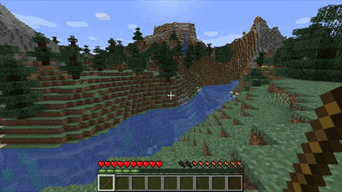

# On / Off Switch

## Requirements+

* ExecutableItems **Premium**

## NOTE: CREATE 2 ACTIVATORS FIRST.

## First activator

### Create a variable

* A variable needs to be created so we can have an identifier if the switch is on/off


### Create your item, and add an activator

* In this case it will be a PLAYER\_ALL\_CLICK

.png>)

### Commands

* Type what commands you want to type

### Variables Modification


### Placeholder Condition

* This is needed to control what activator is going to run&#x20;

.png>)

.png>)

.png>)


### Add the other item cooldown to the item itself

* For example, the id of the ei item is `onoff-demo`. You would then have to go to this icon then follow the pictures.


For example, the id of the on/off switch is "faker", so select "faker".


Ever since 5.0 dropped, activator ids start from "activator0" instead of "activator1". Anyway, you would want to select the second activator as activators run from top to bottom.&#x20;


This option is important because if there's no cooldown, it will ram through the the 2nd activator that's supposed to turn off the activator



This is suggested to be set to true if you want the item to be spammable. One tick is enough to prevent the ramming mentioned above.


## Second activator

* We will use again **`PLAYER_ALL_CLICK`**

.png>)

###

### Commands

* Type what commands you want to type

### Variables Modification


### Placeholder Condition

* This is needed to control what activator is going to run&#x20;

.png>)

.png>)

.png>)


### Add the other item cooldown to the item itself

* For example, the id of the ei item is `onoff-demo`. You would then have to go to this icon then follow the pictures.


For example, the id of the on/off switch is "faker", so select "faker".


Ever since 5.0 dropped, activator ids start from "activator0" instead of "activator1". Anyway, you would want to select the second activator as activators run from top to bottom.&#x20;


This option is important because if there's no cooldown, it will ram through the the 2nd activator that's supposed to turn off the activator



This is suggested to be set to true if you want the item to be spammable. One tick is enough to prevent the ramming mentioned above.


##

### Save the EI Item

* It should look like this (We added on commands to say ON (activator1) and OFF (activator2) to show you how it is working :p



## Item config

```yaml
name: '&e&lOn/Off Demo'
lore: []
material: LEVER
glow: true
disableStack: false
keepItemOnDeath: false
canBeUsedOnlyByTheOwner: false
storeItemInfo: false
unbreakable: false
usage: 1
usageLimit: -1
cancelEventIfNoPerm: false
cancelEventIfNotOwner: false
disabledWorlds: []
recognitions: []
config_5: true
config_update: true
dropOptions:
  glowDrop: false
  glowDropColor: WHITE
  displayNameDrop: false
hiders:
  hideEnchantments: false
  hideUnbreakable: false
  hideAttributes: false
  hidePotionEffects: false
  hideUsage: true
  hideDye: false
enchantments: {}
giveFirstJoin:
  giveFirstJoin: false
  giveFirstJoinAmount: 1
  giveFirstJoinSlot: 0
restrictions:
  cancel-item-place: false
variables:
  x:
    variableName: x
    type: NUMBER
    default: 0.0
attributes: {}
activators:
  activator0:
    name: '&eToggle-On'
    option: PLAYER_ALL_CLICK
    typeTarget: NO_TYPE_TARGET
    usageModification: 0
    cancelEvent: true
    silenceOutput: false
    autoUpdateItem: false
    cooldownOptions:
      cooldown: 0
      isCooldownInTicks: false
      cooldownMsg: '&cYou are in cooldown ! &7(&e%time_H%&6H &e%time_M%&6M &e%time_S%&6S&7)'
      displayCooldownMessage: false
      cancelEventIfInCooldown: false
    globalCooldownOptions:
      cooldown: 0
      isCooldownInTicks: false
      cooldownMsg: '&cYou are in cooldown ! &7(&e%time_H%&6H &e%time_M%&6M &e%time_S%&6S&7)'
      displayCooldownMessage: true
      cancelEventIfInCooldown: false
    otherEICooldowns:
      cd0:
        executableItem: onoff-demo
        activators:
        - activator1
        cooldown: 1
        isCooldownInTicks: true
    requiredItems:
      errorMessage: ''
    requiredExecutableItems:
      errorMessage: ''
    detailedSlots:
    - -1
    commands:
    - SENDMESSAGE Toggled On
    playerConditions: {}
    worldConditions: {}
    itemConditions: {}
    customConditions: {}
    placeholdersConditions:
      plchC1:
        type: PLAYER_NUMBER
        comparator: EQUALS
        part1: '%var_x%'
        part2: '0.0'
        cancelEventIfNotValid: true
        messageIfNotValid: '&e'
    variablesModification:
      varModif0:
        variableName: x
        type: SET
        modification: 1.0
  activator1:
    name: '&eToggle-Off'
    option: PLAYER_ALL_CLICK
    typeTarget: NO_TYPE_TARGET
    usageModification: 0
    cancelEvent: true
    silenceOutput: false
    autoUpdateItem: false
    cooldownOptions:
      cooldown: 0
      isCooldownInTicks: false
      cooldownMsg: '&cYou are in cooldown ! &7(&e%time_H%&6H &e%time_M%&6M &e%time_S%&6S&7)'
      displayCooldownMessage: false
      cancelEventIfInCooldown: false
    globalCooldownOptions:
      cooldown: 0
      isCooldownInTicks: false
      cooldownMsg: '&cYou are in cooldown ! &7(&e%time_H%&6H &e%time_M%&6M &e%time_S%&6S&7)'
      displayCooldownMessage: true
      cancelEventIfInCooldown: false
    otherEICooldowns:
      cd0:
        executableItem: onoff-demo
        activators:
        - activator0
        cooldown: 1
        isCooldownInTicks: true
    requiredItems:
      errorMessage: ''
    requiredExecutableItems:
      errorMessage: ''
    detailedSlots:
    - -1
    commands:
    - SENDMESSAGE Toggled Off
    playerConditions: {}
    worldConditions: {}
    itemConditions: {}
    customConditions: {}
    placeholdersConditions:
      plchC1:
        type: PLAYER_NUMBER
        comparator: EQUALS
        part1: '%var_x%'
        part2: '1.0'
        cancelEventIfNotValid: true
        messageIfNotValid: '&e'
    variablesModification:
      varModif0:
        variableName: x
        type: SET
        modification: 0.0

```

## Last comment

If you have any question or you think the guide wasn't clear enough, feel free to ask in Discord.\
We will help you ! 😁😁
