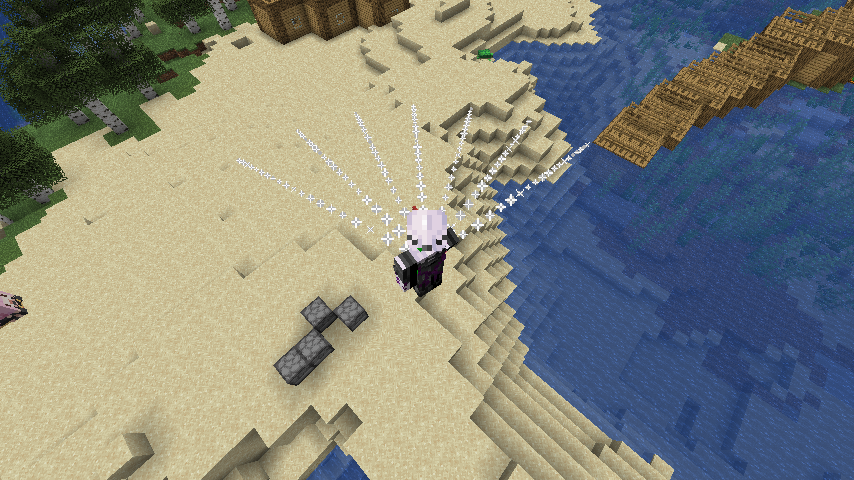

# Raycast


<mark style="color:red;">**WARNING:**</mark>

<mark style="color:red;">**THIS GUIDE CONTAINS A LOT OF MATH AND REQUIRES YOU TO HAVE BASIC KNOWLEDGE ABOUT YAW PITCH VALUES OF A PLAYER**</mark>


Dependencies:

* Placeholder API
* Math Expansion of Placeholder API
* Player Expansion of Placeholder API

## 1) Create an activator of your choice

This method is mostly reliant on commands, math and gathering user yaw pitch values and more. Which means you can also use this method on other Executable plugins by Ssomar.


## 2) Start writing the basic version of the command


```yaml

    - FOR [0.500 ,1.000 ,1.500 ,2.000 ,2.500 ,3.000 ,3.500 ,4.000 ,4.500 ,5.000 ,5.500
      ,6.000 ,6.500 ,7.000 ,7.500 ,8.000 ,8.500 ,9.000 ,9.500 ,10.000 ] > for1
    - execute at %player% run particle firework ~%math_(%for1%)*SIN({player_yaw}*-1)*COS({player_pitch}*-1)%
      ~%math_((%for1%)*SIN({player_pitch}*-1))+1.6% ~%math_(%for1%)*COS({player_yaw}*-1)*COS({player_pitch}*-1)%
    - score run-block-command block:%world%,%math_(%x%)+((%for1%)*SIN({player_yaw}*-1)*COS({player_pitch}*-1))%,%math_((%y%)+((%for1%)*SIN({player_pitch}*-1)))+1.6%,%math_(%z%)+((%for1%)*COS({player_yaw}*-1)*COS({player_pitch}*-1))%
      player:%player% AROUND 0.5 CONDITIONS(%::player_name::%!=%player%) DAMAGE 10
    - score run-block-command block:%world%,%math_(%x%)+((%for1%)*SIN({player_yaw}*-1)*COS({player_pitch}*-1))%,%math_((%y%)+((%for1%)*SIN({player_pitch}*-1)))+1.6%,%math_(%z%)+((%for1%)*COS({player_yaw}*-1)*COS({player_pitch}*-1))%
      player:%player% MOB_AROUND 0.5 DAMAGE 10
    - ENDFOR for1
```

Explanation for the code:

* The FOR loop represents the distance from the user. As you can see, the for loop shows an increasing value by 0.5 meaning that we're trying to form a line with these distance values. If you want the beam to be longer, add more numbers to the for1 loop
* Using the math formula from [https://docs.ssomar.com/tools-for-all-plugins-score/general-questions-or-guides/math-formulas#particle-related-math-formulas](https://docs.ssomar.com/tools-for-all-plugins-score/general-questions-or-guides/math-formulas#particle-related-math-formulas), by replacing the distance value with the %for1% placeholder, we can&#x20;
* Same will be applied with the `score run-block-command` . The reason why this command is used is to be able to declare where the AROUND command should come from.&#x20;

With all of these information, we're practically just organizing a line of circles to create a "ray".

## 3) Modifying the current command to create a "spread raycast"

```yaml
    - FOR [45.000 ,30.000 ,15.000 ,0.000 ,-15.000 ,-30.000 ,-45.000 ] > for2
    - FOR [0.500 ,1.000 ,1.500 ,2.000 ,2.500 ,3.000 ,3.500 ,4.000 ,4.500 ,5.000 ,5.500
      ,6.000 ,6.500 ,7.000 ,7.500 ,8.000 ,8.500 ,9.000 ,9.500 ,10.000 ] > for1
    - execute at %player% run particle firework ~%math_(%for1%)*SIN(({player_yaw}+%for2%)*-1)*COS({player_pitch}*-1)%
      ~%math_((%for1%)*SIN({player_pitch}*-1))+1.6% ~%math_(%for1%)*COS(({player_yaw}+%for2%)*-1)*COS({player_pitch}*-1)%
    - score run-block-command block:%world%,%math_(%x%)+((%for1%)*SIN(({player_yaw}+%for2%)*-1)*COS({player_pitch}*-1))%,%math_((%y%)+((%for1%)*SIN({player_pitch}*-1)))+1.6%,%math_(%z%)+((%for1%)*COS(({player_yaw}+%for2%)*-1)*COS({player_pitch}*-1))%
      player:%player% AROUND 0.5 CONDITIONS(%::player_name::%!=%player%) DAMAGE 10
      <+> INVULNERABILITY 5
    - score run-block-command block:%world%,%math_(%x%)+((%for1%)*SIN(({player_yaw}+%for2%)*-1)*COS({player_pitch}*-1))%,%math_((%y%)+((%for1%)*SIN({player_pitch}*-1)))+1.6%,%math_(%z%)+((%for1%)*COS(({player_yaw}+%for2%)*-1)*COS({player_pitch}*-1))%
      player:%player% MOB_AROUND 0.5 DAMAGE 10
    - ENDFOR for1
    - ENDFOR for2
```

* I added another for loop to create an arc shape. I made it so it shoots 7 lasers instead of 1 and have a 90 degrees arc (45 to the left and 45 to the right). I also modified the {player\_yaw} placeholder to be added along with the %for2% placeholder to compute the supposed yaw value if the player looked at 15 degrees to the right for example
* Then of course I gave the other commands the appropriate command modification

<figure><figcaption></figcaption></figure>

You can always adjust the first loop to customize the size of the arc and the amount of lasers that will be deployed per activation.
