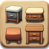

# 📌 Information MyFurniture

## Description

MyFurniture allows you to add a bunch of Furniture to your server, and adding unique activators on them! With this plugin, the possibilities are truly endless.&#x20;

Your furniture will have a perfect hit and bounding box. MyFurniture is not like all other simple plugin that create 1\*1 bounding box. With MF the furniture bounding box match with the your custom texture ! Normally you only see that in custom mod ! But now its possible without client edits with MyFurniture.

## Support

#### Need help, report a bug or submit a suggestion? Something is not in the wiki or poorly explained ?

* Join the [Discord](https://discord.com/invite/TRmSwJaYNv)

## Free version

* Download on [Modrinth](https://modrinth.com/plugin/myfurniture)
* Download on [Spigot](https://www.spigotmc.org/resources/%E2%9B%A9%EF%B8%8F-myfurniture-%E2%AD%90-add-custom-furniture-%E2%AD%90-clean-hit-and-bounding-box-custom-triggers-quick-setup.79024/)
* Download on [Discord](https://discord.com/channels/701066025516531753/1344653685669498995)

## Premium version (4.99€/month) 


You want the access to all the features, and support my work ?

&#x20;You can subscribe on the discord into the [channel subscription](https://discord.com/channels/701066025516531753/1333041782010937385).

