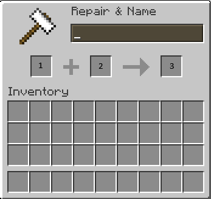

# ✨    SCore particles

## PAGE CREATION IN PROGRESS (it remains GIF and some examples to add)




Score includes many pre-made particles shapes from XParticle library and some custom other.&#x20;

## How to display the particles

The command to display the particle is `/score particles`

You will have to select a shape and configure correctly the command to achieve to do what you want.

### How to remove displayed particles

The command to clear displayed particles is `/score clear {player} PARTICLES`&#x20;


## General settings for all shapes

### Define the spawn point

To define where the shape will be displayed you have two choice, by mentioning directly the location or setting an entity UUID&#x20;

#### Using Player/Entity UUID

When you decide to use the entity UUID **the shape will follow en Player/Entity if he moves**. So it can deform the shape or make a cool effect.

```css
target:{uuid of the target}
/* Example using flat UUID */
target:b33183ad-e9c0-4d48-8eea-f8c9358d3568
/* Example using a placeholder */
target:%player_uuid%
```


You have to specify an UUID of a player or an entity. The player name doesn't work !


#### Using a specific location

Using location you are sure that the shape will not be deformed, it will stay static.

```css
location:{world},{x},{y},{z}
/* Example using flat location */
location:world,100,50,500
/* Example using placeholders */
location:%player_world%,%player_x%,%player_y%,%player_z%
```


### Particles definition

#### Particle type

Define the particle used by the shape. By default it will be the FLAME particle

```css
particle:{the particle type}
/* Example */
particle:CLOUD
```

List of particles available here: [List of Spigot particles ](https://hub.spigotmc.org/javadocs/bukkit/org/bukkit/Particle.html)

#### Color

**Instead** of using `particle:{particle name}`  if you want to use REDSTONE / DUST particles you can directly use the setting color with a [custom color](https://hub.spigotmc.org/javadocs/bukkit/org/bukkit/Color.html).

You can set two colors separated by a , to have a color transition.

```css
color:{color Name}
/* Example one color */
color:RED
/* Example two colors with transition */
color:AQUA,BLUE
```

#### Block particles

**Instead** of using `particle:{particle name}`  if you want to use BLOCK\_CRACK / BLOCK particles you can directly use the setting blockdata with a [material](https://hub.spigotmc.org/javadocs/bukkit/org/bukkit/Material.html).

```css
blockdata:{material}
/* Example */
blockdata:LAVA
```

#### Item particles

**Instead** of using `particle:{particle name}`  if you want to use ITEM\_CRACK/ ITEM particles you can directly use the setting itemstack with a [material](https://hub.spigotmc.org/javadocs/bukkit/org/bukkit/Material.html).

```css
itemstack:{material}
/* Example */
itemstack:DIAMOND_SHOVEL
```

### Offset / Shift the spawn point of the shape&#x20;

You can define an offset in a specific direction, it allows you for example to display the shape around the player / entity, without having to do complex calculation.

* offsetPitch: the pitch direction where the offset will be directed
* offsetYaw: the yaw direction where the offset will be directed
* offsetSitance: the distance of the offset
* offsetX: Increase the offset X location
* offsetY: Increase the offset Y location
* offsetZ: Increase the offset Z location

By default these settings are set to 0

```css
offsetPitch:{the pitch direction}
offsetYaw:{the yaw direction}
offsetDistance:{the distance}
offsetX:{x bonus}
offsetY:{y bonus}
offsetZ:{z bonus}
/* Example with flat values */
offsetPitch:0
offsetYaw:-90
offsetDistance:5
offsetY:-1
/* Example with placeholders */
offsetPitch:%player_pitch_initial%+30
offsetYaw:%player_yaw_initial%
offsetDistance:%var_myvar%
```

<figure><figcaption></figcaption></figure>

## Settings of the shapes

### Atom

Creates a set of elliptical orbits with a small particle sphere at the center, resembling an atom.

* `orbits`: Number of elliptical orbits.
* `radius`: Radius of the orbits in blocks
* `rate`: Number of particles per orbit.

```yaml
# Examples that you can run manually in-game
/score particles shape:atom color:BLUE,YELLOW orbits:4 radius:5.0 rate:100 offsetY:1
/score particles shape:atom particle:CLOUD orbits:10 radius:20.5 rate:100 offsetY:1
# Examples that you can include into your commands

```

### Atomic

Animated version of `atom` with orbiting particles.

* `orbits`: Number of orbiting paths.
* `radius`: Radius of orbit in blocks.
* `rate`: Rate of orbit.
* `time`: Duration in ticks.

<pre class="language-yaml"><code class="lang-yaml"><strong># Examples that you can run manually in-game
</strong>/score particles shape:atomic orbits:15 radius:5 rate:100 offsetY:1 time:200

# Examples that you can include into your commands

</code></pre>

### BlackSun

Multiple concentric circles increasing in size.

* `radius`: Max radius in blocks.
* `radiusRate`: Difference in radius between each circle.
* `rate`: Particle density.
* `rateChange`: Change of rate per layer.

```yaml
# Examples that you can run manually in-game
/score particles shape:blacksun radius:10 radiusRate:0.5 rate:200 rateChange:10

# Examples that you can include into your commands
```

### BlackHole

A dynamic particle vortex effect.

* `points`: Number of spiral arms.
* `radius`: Distance from center.
* `rate`: Rotation rate.
* `mode`: 0 to 4 for different vortex styles.
* `time`: Duration in ticks.

<pre class="language-yaml"><code class="lang-yaml"><strong># Examples that you can run manually in-game
</strong>/score particles particle:SMOKE shape:blackhole points:30 radius:2.5 rate:1 mode:2 time:50

# Examples that you can include into your commands
</code></pre>


### ChaoticDoublePendulum

Simulates a chaotic double pendulum effect.

* `radius`: Swing radius.
* `gravity`: Gravity force (typically -1).
* `length`, `length2`: Lengths of the pendulums.
* `mass1`, `mass2`: Mass of each pendulum.
* `dimension3`: Whether to use 3D rotation.
* `speed`: Animation speed.
* `time`: Duration in ticks.

```yaml
# Examples that you can run manually in-game
/score particles shape:chaoticDoublePendulum radius:2 gravity:-1 length:200 length2:200 mass1:50 mass2:50 dimension3:false speed:2 time:200
/score particles shape:chaoticDoublePendulum color:RED,YELLOW radius:1 gravity:-1 length:200 length2:2000 mass1:50 mass2:50 dimension3:true speed:2 time:200
/score particles shape:chaoticDoublePendulum particle:FLAME radius:2 gravity:5 length:200 length2:200 mass1:50 mass2:50 dimension3:false speed:2 time:200
# Examples that you can include into your commands
```

### Circle

Displays a circle of particles.

* `radius`: radius of the circle
* `density`: number of particles per block (higher = more dense).
* `drawMode`: clockWise, counterClockWise, random
* `fillMode`: disk, spiral, ring
* `time`: time in ticks to animate the full display. (0 = instant)
* `directionPitch`: pitch direction of the circle
* `directionYaw`: yaw direction of the circle

Examples:

```yaml
# Examples that you can include into your commands
# Display multiple Green circles in front the player
commands:
- FOR [+20,-20,+40,-40,+60,-60,+80,-80,+100,-100] > for3
- score particles shape:circle location:%player_world_initial%,%player_x_initial%,%player_y_initial%,%player_z_initial% color:GREEN,WHITE radius:3 density:100 time:10 drawMode:clockwise offsetDistance:8 offsetPitch:0 offsetYaw:%player_yaw_initial%%for3%  directionYaw:%player_yaw_initial%%for3% fillMode:disk directionPitch:-90 offsetY:-1
- END_FOR for3
```

### CircularBeam

Animated beam with changing circle sizes over time.

* `maxRadius`: Max circle radius in blocks.
* `rate`: Point rate per circle.
* `radiusRate`: Change in radius.
* `extend`: Extension distance in blocks.
* `time`: Duration in ticks.

```yaml
# Examples that you can run manually in-game
/score particles shape:circularBeam color:PURPLE maxRadius:5 rate:500 radiusRate:15 extend:1 time:100

# Examples that you can include into your commands
```

### Cone

Cone made of stacked circles.

* `height`: Height of the cone.
* `radius`: Base radius.
* `rate`: Circle spacing.
* `circleRate`: Points density.
* `fillMode`: the fill Mode "disk", "ring", "spiral", by default its disk

```yaml
# Examples that you can run manually in-game
/score particles shape:cone color:GREEN,YELLOW height:3 radius:2 rate:0.4 circleRate:40 fillMode:ring

# Examples that you can include into your commands
```

### Crescent

Renders a crescent moon using two overlapping circles.

* `radius`: size of the outer arc.
* `rate`: resolution of the curve.
* `directionYaw`: direction of the crescent in degrees

```yaml
# Examples that you can run manually in-game
/score particles shape:crescent radius:3 rate:100 directionYaw:90 color:RED,YELLOW

# Examples that you can include into your commands
```

### Cylinder

* `radius`: radius of the cylinder
* `height`: the height of the cylinder
* `density`: number of particles per block (higher = more dense).
* `drawMode`: clockWise, counterClockWise, random
* `timeToDisplay`: time in ticks to animate the full display.
* `directionPitch`: pitch direction of the square
* `directionYaw`: yaw direction of the square

Examples:

```yaml
# Examples that you can include into your commands
# Display two green cylinder in front of the player
- FOR [+20,-20] > for3
- score particles shape:cylinder location:%player_world_initial%,%player_x_initial%,%player_y_initial%,%player_z_initial% color:GREEN,WHITE radius:1 density:100 timeToDisplay:5 drawMode:clockwise offsetDistance:8 offsetPitch:0 offsetYaw:%player_yaw_initial%%for3%  directionYaw:%player_yaw_initial%%for3% directionPitch:-90 offsetY:-1 height:3
- END_FOR for3
```

### Diamond

Creates a diamond (rhombus) shape in 2D or 3D.

* `radiusRate`: Controls the width.
* `rate`: Spacing between points.
* `height`: Total height.

```yaml
# Examples that you can run manually in-game
/score particles shape:diamond color:BLUE,AQUA radiusRate:0.6 rate:0.4 height:3

# Examples that you can include into your commands
```

### DNA

Displays a DNA double helix with hydrogen bonds.

* `radius`: Radius of the helices.
* `rate`: Spacing between points.
* `extension`: Helix stretch factor.
* `height`: Total height.

```yaml
# Examples that you can run manually in-game
/score particles shape:dna color:BLUE,AQUA radius:10 rate:0.1 height:4 extension:15

# Examples that you can include into your commands
```

### DNA Replication

Simulates DNA replication with bonds and colors.

* `radius`, `rate`, `extension`, `height`: Same as `DNA`.
* `speed`: Animation speed.
* `hydrogenBondDist`: Distance between bonds.

```yaml
# Examples that you can run manually in-game
/score particles shape:dnaReplication color:BLUE,AQUA radius:4 rate:0.2 height:3 extension:5 hydrogenBondDist:1 speed:1

# Examples that you can include into your commands
```

### Ellipse

* `start`, `end`: Start and end angles.
* `rate`: Angular spacing.
* `radius`, `otherRadius`: X and Y radii.

```yaml
# Examples that you can run manually in-game
/score particles shape:ellipse color:BLUE,AQUA radius:3 rate:0.8 otherRadius:2 start:50 end:200 offsetY:1

# Examples that you can include into your commands
```

### ExplosionWave

Wavy animation representing an explosion shockwave.

* `rate`: Particle density within the wave.
* `start`: the initial distance from the center to start the wave.
* `height`: the vertical amplitude of the wave.

```yaml
# Examples that you can run manually in-game
/score particles shape:explosionWave rate:5 start:-3 height:3
/score particles shape:explosionWave rate:5 height:1 offsetY:-1
/score particles shape:explosionWave rate:10
# Examples that you can include into your commands
```

### Eye

Draws an oval eye-like shape.

* `radius`, `radius2`: Primary radii.
* `rate`: Resolution.
* `extension`: Elongation factor
* `directionPitch`: pitch direction of the eye
* `directionYaw`: yaw direction of the eye

```yaml
# Examples that you can run manually in-game
/score particles shape:eye particle:INFESTED radius:2 radius2:2 extension:1 rate:100 directionYaw:-164

# Examples that you can include into your commands
```

### Heart

Draws a heart using a polar curve.

* `cut`, `cutAngle`: Adjust the heart’s lobes.
* `depth`: Central notch depth.
* `compressHeight`: Vertical compression.
* `rate`: Resolution.
* `directionPitch`: pitch direction of the heart
* `directionYaw`: yaw direction of the heart

```yaml
# Examples that you can run manually in-game
/score particles shape:heart particle:HEART cut:4 cutAngle:2 depth:2 compressHeight:1 rate:100 offsetY:-1 directionYaw:-75

# Examples that you can include into your commands
```

### Helix

Draws animated 3D helices.

* `strings`: Number of helices.
* `radius`: Helix radius.
* `rate`, `extension`: Spacing and spiral strength.
* `height`: Total height.
* `speed`: Animation speed.
* `fadeUp`, `fadeDown`: Gradual change in radius.

```yaml
# Examples that you can run manually in-game
/score particles shape:helix particle:TOTEM_OF_UNDYING strings:3 radius:2.5 rate:0.1 extension:2 height:3 speed:2 fadeUp:true fadeDown:true

# Examples that you can include into your commands
```

### Illuminati

Creates a 3D infinity symbol shape.

* `size`: Size of the shape.
* `extension`: The extension of the illuminati eye.

```yaml
# Examples that you can run manually in-game
/score particles shape:illuminati particle:SCULK_SOUL size:5 extension:15

# Examples that you can include into your commands
```

### Infinity


### MagicCircles

Displays expanding rings like magical glyphs.

* `radius`: Initial radius.
* `rate`: Point spacing.
* `radiusRate`: Growth speed.
* `distance`: Spacing between rings.
* `time`: Duration in ticks.

```yaml
# Examples that you can run manually in-game
/score particles shape:magicCircles radius:1 rate:3 radiusRate:1 time:20

# Examples that you can include into your command
```

### MeguminExplosion

Stylized magical explosion effect.

* `size`: Overall explosion size.

```yaml
# Examples that you can run manually in-game
/score particles shape:meguminExplosion color:RED size:5

# Examples that you can include into your commands
```

### Polygon

Draws a polygon with optional internal connections

* `points`: Number of corners.
* `connection`: How many corners to connect.
* `size`: Radius of the polygon.
* `rate`: Resolution.
* `extend`: Connection extension factor.

```yaml
# Examples that you can run manually in-game
/score particles shape:polygon points:5 connection:5 size:5 rate:1 extend:1

# Examples that you can include into your commands
```

### Rainbow

Displays stacked rainbow arcs with colored layers.

* `radius`: Radius of the rainbow
* `rate`: Rate of points more = more points
* `curve`: Curve 1 for up and -1 for down
* `layers`: Number of arcs.
* `compact`: Reduces spacing between arcs.

```yaml
# Examples that you can run manually in-game
/score particles shape:rainbow radius:3 rate:100 curve:2 layers:1 compact:1

# Examples that you can include into your commands
```

### Ring

Draws a flat ring (annulus).

* `radius`: Radius of the ring.
* `density`: Particle density.
* `time`: Durationto display in ticks.
* `drawMode`: Drawing order : clockWise, counterClockWise or random
* `directionPitch`: pitch direction of the circle
* `directionYaw`: yaw direction of the circle

```yaml
# Examples that you can run manually in-game
/score particles particle:SONIC_BOOM shape:ring radius:5 density:100 time:0

# Examples that you can include into your commands
```

### Sphere

Draws a full 3D sphere.

* `radius`: Sphere radius.
* `rate`: Density of points

```yaml
# Examples that you can run manually in-game
/score particles particle:SNEEZE shape:sphere radius:5 rate:30

# Examples that you can include into your commands
```

### SpikeSphere

Draws a sphere with random spikes.

* `radius`, `rate`: Base sphere parameters.
* `chance`: Chance of spike.
* `minRandomDistance`, `maxRandomDistance`: Spike length range.

```yaml
# Examples that you can run manually in-game
/score particles particle:GLOW shape:spikeSphere radius:4 rate:20 chance:30 minRandomDistance:2 maxRandomDistance:4

# Examples that you can include into your commands
```


### Square

* `height`: height in blocks along vertical axis.
* `length`: length in blocks along direction vector.
* `width`: width in blocks perpendicular to the wall direction.
* `density`: number of particles per block (higher = more dense).
* `timeToDisplay`: time in ticks to animate the full display.
* `drawMode`: "vertical" or "horizontal" — controls iteration order.
* `verticalOrder`: "up" or "down" — order along height.
* `horizontalOrder`: "near" or "far" — order along length.
* `directionPitch`: pitch direction of the square
* `directionYaw`: yaw direction of the square

```yaml
# Examples that you can run manually in-game
...

# Examples that you can include into your commands
commands:
# A line of explosion
- score particles shape:square location:%player_world_initial%,%player_x_initial%,%player_y_initial%,%player_z_initial% particle:EXPLOSION height:1 length:30 timeToDisplay:20 density:1 directionYaw:%player_yaw_initial% directionPitch:%player_pitch_initial% verticalOrder:up horizontalOrder:near offsetY:-1
# A wall of flame
- score particles shape:square location:%player_world_initial%,%player_x_initial%,%player_y
```

### Star

Creates a 3D star with animated spikes.

* `points`: Number of base sides.
* `spikes`: Number of star tips.
* `rate`: How many display of points
* `spikeLength`: Tip length.
* `coreRadius`: Core radius.
* `neuron`: Tip curvature.
* `prototype`: Use helices instead of lines.
* `speed`: Animation speed.

```yaml
# Examples that you can run manually in-game
/score particles shape:star points:5 spikes:5 rate:20 spikeLength:20 coreRadius:4 speed:1 neuron:3

# Examples that you can include into your commands
```

### Tesseract

Draws tesseract

* `size`: Overall size.
* `rate`: Density.
* `speed`: speed.
* `time`: Display time.

```yaml
# Examples that you can run manually in-game
/score particles shape:tesseract size:3 rate:100 speed:2 time:200 offsetY:2 particle:END_ROD

# Examples that you can include into your commands
```

### Vortex

Spiral effect like a galaxy or tornado.

* `points`: Number of spiral arms.
* `rate`: Rotation speed.
* `time`: Duration.

```yaml
# Examples that you can run manually in-game
/score particles shape:vortex particle:ENCHANT points:5 rate:25 time:100 offsetY:2

# Examples that you can include into your commands
```


