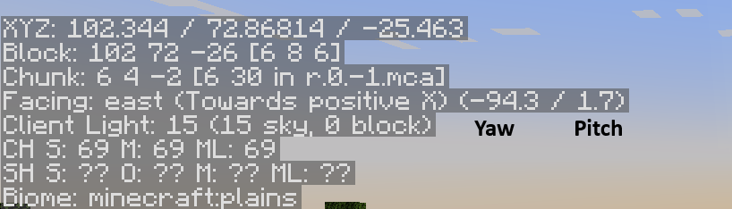

# ✨    Score particles



Score includes many pre-made particles shapes from XParticle library and some custom other.&#x20;

The attached link will direct you to the list of all **available particle types**.

<details>

<summary>Shapes</summary>

* &#x20;atom&#x20;
* &#x20;atomic&#x20;
* blackSun&#x20;
* blackhole&#x20;
* cage&#x20;
* chaoticDoublePendulum&#x20;
* circle&#x20;
* circularBeam&#x20;
* cone&#x20;
* crescent&#x20;
* cube&#x20;
* cylinder&#x20;
* diamond&#x20;
* dna&#x20;
* dnaReplication&#x20;
* ellipse&#x20;
* explosionWave&#x20;
* eye&#x20;
* filledCircle&#x20;
* filledCube&#x20;
* flower&#x20;
* guard&#x20;
* heart&#x20;
* helix&#x20;
* hypercube&#x20;
* illuminati&#x20;
* infinity&#x20;
* julia&#x20;
* magicCircles&#x20;
* mandelbrot&#x20;
* meguminExplosion&#x20;
* moveRotatingAround&#x20;
* polygon&#x20;
* rainbow&#x20;
* rectangle&#x20;
* ring&#x20;
* sphere&#x20;
* spikeSphere&#x20;
* spread&#x20;
* star&#x20;
* structuredCube&#x20;
* tesseract&#x20;
* vortex&#x20;
* waveFunction

</details>

## How to display the particles

The command to display the particle is `/score particles`

You will have to select a shape and configure correctly the command to achieve to do what you want.


## General settings for all shapes

### Define the spawn point

To define where the shape will be displayed you have two choice, by mentioning directly the location or setting an entity UUID&#x20;

#### Using Player/Entity UUID

When you decide to use the entity UUID **the shape will follow en Player/Entity if he moves**. So it can deform the shape or make a cool effect.

```css
target:{uuid of the target}
/* Example using flat UUID */
target:b33183ad-e9c0-4d48-8eea-f8c9358d3568
/* Example using a placeholder */
target:%player_uuid%
```


You have to specify an UUID of a player or an entity. The player name doesn't work !


#### Using a specific location

Using location you are sure that the shape will not be deformed, it will stay static.

```css
location:{world},{x},{y},{z}
/* Example using flat location */
location:world,100,50,500
/* Example using placeholders */
location:%player_world%,%player_x%,%player_y%,%player_z%
```


### Particles definition

#### Particle type

Define the particle used by the shape. By default it will be the FLAME particle

```css
particle:{the particle type}
/* Example */
particle:CLOUD
```

List of particles available here: [List of Spigot particles ](https://hub.spigotmc.org/javadocs/bukkit/org/bukkit/Particle.html)

#### Color

**Instead** of using `particle:{particle name}`  if you want to use REDSTONE / DUST particles you can directly use the setting color with a [custom color](https://hub.spigotmc.org/javadocs/bukkit/org/bukkit/Color.html).

You can set two colors separated by a , to have a color transition.

```css
color:{color Name}
/* Example one color */
color:RED
/* Example two colors with transition */
color:AQUA,BLUE
```

#### Block particles

**Instead** of using `particle:{particle name}`  if you want to use BLOCK\_CRACK / BLOCK particles you can directly use the setting blockdata with a [material](https://hub.spigotmc.org/javadocs/bukkit/org/bukkit/Material.html).

```css
blockdata:{material}
/* Example */
blockdata:LAVA
```

#### Item particles

**Instead** of using `particle:{particle name}`  if you want to use ITEM\_CRACK/ ITEM particles you can directly use the setting itemstack with a [material](https://hub.spigotmc.org/javadocs/bukkit/org/bukkit/Material.html).

```css
itemstack:{material}
/* Example */
itemstack:DIAMOND_SHOVEL
```

### Offset / Shift the spawn point of the shape&#x20;

You can define an offset in a specific direction, it allows you for example to display the shape around the player / entity, without having to do complex calculation.

* offsetPitch: the pitch direction where the offset will be directed
* offsetYaw: the yaw direction where the offset will be directed
* offsetSitance: the distance of the offset
* offsetX: Increase the offset X location
* offsetY: Increase the offset Y location
* offsetZ: Increase the offset Z location

By default these settings are set to 0

```css
offsetPitch:{the pitch direction}
offsetYaw:{the yaw direction}
offsetDistance:{the distance}
offsetX:{x bonus}
offsetY:{y bonus}
offsetZ:{z bonus}
/* Example with flat values */
offsetPitch:0
offsetYaw:-90
offsetDistance:5
offsetY:-1
/* Example with placeholders */
offsetPitch:%player_pitch_initial%+30
offsetYaw:%player_yaw_initial%
offsetDistance:%var_myvar%
```

<figure><figcaption></figcaption></figure>

## Settings of the shapes

### Circle

* radius: radius of the circle
* density: number of particles per block (higher = more dense).
* drawMode: clockWise, counterClockWise, random
* fillMode: disk, spiral, ring
* timeToDisplay: time in ticks to animate the full display.
* directionPitch: pitch direction of the square
* directionYaw: yaw direction of the square

Examples:

```yaml
# Examples that you can include into your commands
# Display multiple Green circles in front the player
commands:
- FOR [+20,-20,+40,-40,+60,-60,+80,-80,+100,-100] > for3
- score particles shape:circle location:%player_world_initial%,%player_x_initial%,%player_y_initial%,%player_z_initial% color:GREEN,WHITE radius:3 density:100 timeToDisplay:10 drawMode:clockwise offsetDistance:8 offsetPitch:0 offsetYaw:%player_yaw_initial%%for3%  directionYaw:%player_yaw_initial%%for3% fillMode:disk directionPitch:-90 offsetY:-1
- END_FOR for3
```

### Cylinder

* radius: radius of the cylinder
* height: the height of the cylinder
* density: number of particles per block (higher = more dense).
* drawMode: clockWise, counterClockWise, random
* timeToDisplay: time in ticks to animate the full display.
* directionPitch: pitch direction of the square
* directionYaw: yaw direction of the square

Examples:

```yaml
# Examples that you can include into your commands
# Display two green cylinder in front of the player
- FOR [+20,-20] > for3
- score particles shape:cylinder location:%player_world_initial%,%player_x_initial%,%player_y_initial%,%player_z_initial% color:GREEN,WHITE radius:1 density:100 timeToDisplay:5 drawMode:clockwise offsetDistance:8 offsetPitch:0 offsetYaw:%player_yaw_initial%%for3%  directionYaw:%player_yaw_initial%%for3% directionPitch:-90 offsetY:-1 height:3
- END_FOR for3
```

### Square

* height: height in blocks along vertical axis.
* length: length in blocks along direction vector.
* width: width in blocks perpendicular to the wall direction.
* density: number of particles per block (higher = more dense).
* timeToDisplay: time in ticks to animate the full display.
* drawMode: "vertical" or "horizontal" — controls iteration order.
* verticalOrder: "up" or "down" — order along height.
* horizontalOrder: "near" or "far" — order along length.
* directionPitch: pitch direction of the square
* directionYaw: yaw direction of the square

```yaml
# Examples that you can run manually in-game
...

# Examples that you can include into your commands
commands:
# A line of explosion
- score particles shape:square location:%player_world_initial%,%player_x_initial%,%player_y_initial%,%player_z_initial% particle:EXPLOSION height:1 length:30 timeToDisplay:20 density:1 directionYaw:%player_yaw_initial% directionPitch:%player_pitch_initial% verticalOrder:up horizontalOrder:near offsetY:-1
# A wall of flame
- score particles shape:square location:%player_world_initial%,%player_x_initial%,%player_y_initial%,%player_z_initial% particle:FLAME height:3.5 length:30 timeToDisplay:5 density:3 directionYaw:%player_yaw_initial% directionPitch:%player_pitch_initial% verticalOrder:up horizontalOrder:near
```


